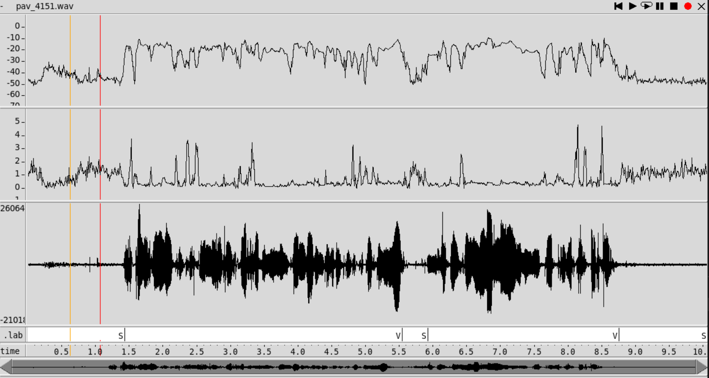
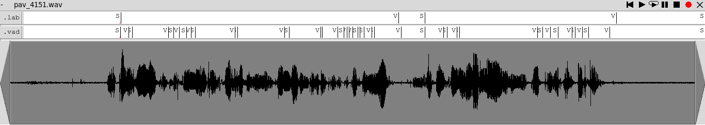
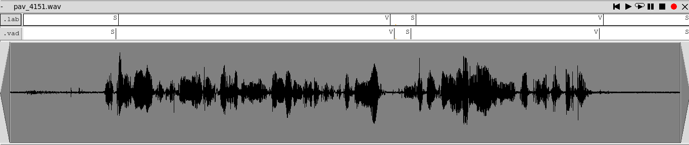
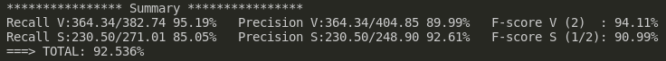
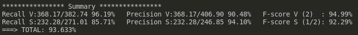
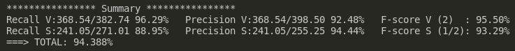
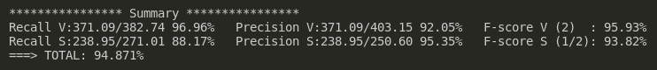
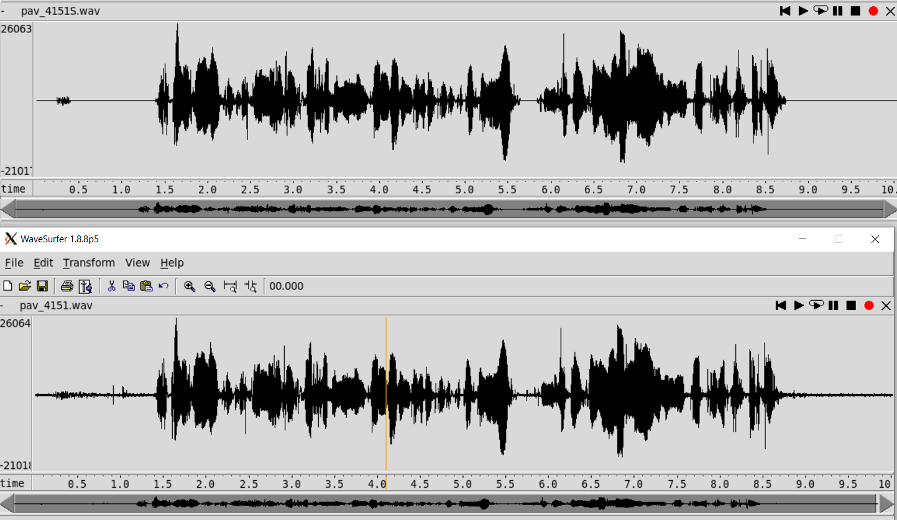
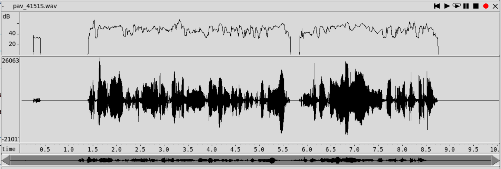
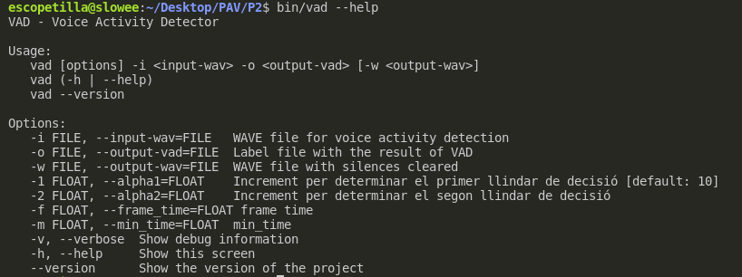

PAV - P2: detección de actividad vocal (VAD)
============================================

Esta práctica se distribuye a través del repositorio GitHub [Práctica 2](https://github.com/albino-pav/P2),
y una parte de su gestión se realizará mediante esta web de trabajo colaborativo.  Al contrario que Git,
GitHub se gestiona completamente desde un entorno gráfico bastante intuitivo. Además, está razonablemente
documentado, tanto internamente, mediante sus [Guías de GitHub](https://guides.github.com/), como
externamente, mediante infinidad de tutoriales, guías y vídeos disponibles gratuitamente en internet.


Inicialización del repositorio de la práctica.
----------------------------------------------

Para cargar los ficheros en su ordenador personal debe seguir los pasos siguientes:

*	Abra una cuenta GitHub para gestionar esta y el resto de prácticas del curso.
*	Cree un repositorio GitHub con el contenido inicial de la práctica (sólo debe hacerlo uno de los
	integrantes del grupo de laboratorio, cuya página GitHub actuará de repositorio central del grupo):
	-	Acceda la página de la [Práctica 2](https://github.com/albino-pav/P2).
	-	En la parte superior derecha encontrará el botón **`Fork`**. Apriételo y, después de unos segundos,
		se creará en su cuenta GitHub un proyecto con el mismo nombre (**P2**). Si ya tuviera uno con ese 
		nombre, se utilizará el nombre **P2-1**, y así sucesivamente.
*	Habilite al resto de miembros del grupo como *colaboradores* del proyecto; de este modo, podrán
	subir sus modificaciones al repositorio central:
	-	En la página principal del repositorio, en la pestaña **:gear:`Settings`**, escoja la opción 
		**Collaborators** y añada a su compañero de prácticas.
	-	Éste recibirá un email solicitándole confirmación. Una vez confirmado, tanto él como el
		propietario podrán gestionar el repositorio, por ejemplo: crear ramas en él o subir las
		modificaciones de su directorio local de trabajo al repositorio GitHub.
*	En la página principal del repositorio, localice el botón **Branch: master** y úselo para crear
	una rama nueva con los primeros apellidos de los integrantes del equipo de prácticas separados por
	guion (**fulano-mengano**).
*	Todos los miembros del grupo deben realizar su copia local en su ordenador personal.
	-	Copie la dirección de su copia del repositorio apretando en el botón **Clone or download**.
		Asegúrese de usar *Clone with HTTPS*.
	-	Abra una sesión de Bash en su ordenador personal y vaya al directorio **PAV**. Desde ahí, ejecute:

		```.sh
		git clone dirección-del-fork-de-la-práctica
		```

	-	Vaya al directorio de la práctica `cd P2`.
	-	Añada la etiqueta `origin` a su copia del repositorio. Esto es útil para facilitar los *push* y
		*pull* al repositorio original:
		```.sh
		git remote add origin dirección-del-fork-de-la-práctica
		```
	-	Cambie a la rama **fulano-mengano** con la orden:

		```.sh
		git checkout fulano-mengano
		```

*	A partir de este momento, todos los miembros del grupo de prácticas pueden trabajar en su directorio
	local del modo habitual.
	-	También puede utilizar el repositorio remoto como repositorio central para el trabajo colaborativo
		de los distintos miembros del grupo de prácticas; o puede serle útil usarlo como copia de
		seguridad.
	-	Cada vez que quiera subir sus cambios locales al repositorio GitHub deberá confirmar los
		cambios en su directorio local:

		```.sh
		git add .
		git commit -m "Mensaje del commit"
		```

		y, a continuación, subirlos con la orden:

		```.sh
		git push -u origin fulano-mengano
		```

*	Al final de la práctica, la rama **fulano-mengano** del repositorio GitHub servirá para remitir la
	práctica para su evaluación utilizando el mecanismo *pull request*.
	-	Vaya a la página principal de la copia del repositorio y asegúrese de estar en la rama
		**fulano-mengano**.
	-	Pulse en el botón **New pull request**, y siga las instrucciones de GitHub.


Entrega de la práctica.
-----------------------

Responda, en este mismo documento (README.md), los ejercicios indicados a continuación. Este documento es
un fichero de texto escrito con un formato denominado _**markdown**_. La principal característica de este
formato es que, manteniendo la legibilidad cuando se visualiza con herramientas en modo texto (`more`,
`less`, editores varios, ...), permite amplias posibilidades de visualización con formato en una amplia
gama de aplicaciones; muy notablemente, **GitHub**, **Doxygen** y **Facebook** (ciertamente, :eyes:).

En GitHub. cuando existe un fichero denominado README.md en el directorio raíz de un repositorio, se
interpreta y muestra al entrar en el repositorio.

Debe redactar las respuestas a los ejercicios usando Markdown. Puede encontrar información acerca de su
sintáxis en la página web [Sintaxis de Markdown](https://daringfireball.net/projects/markdown/syntax).
También puede consultar el documento adjunto [MARKDOWN.md](MARKDOWN.md), en el que se enumeran los
elementos más relevantes para completar la redacción de esta práctica.

Recuerde realizar el *pull request* una vez completada la práctica.

Ejercicios
----------

### Etiquetado manual de los segmentos de voz y silencio

- Etiquete manualmente los segmentos de voz y silencio del fichero grabado al efecto. Inserte, a 
  continuación, una captura de `wavesurfer` en la que se vea con claridad la señal temporal, el contorno de
  potencia y la tasa de cruces por cero, junto con el etiquetado manual de los segmentos.



***Grafica de la señal temporal, cotorno de potencia y ZCR***

- A la vista de la gráfica, indique qué valores considera adecuados para las magnitudes siguientes:

	* Incremento del nivel potencia en dB, respecto al nivel correspondiente al silencio inicial, para
	  estar seguros de que un segmento de señal se corresponde con voz.
	  
	  Viendo que el silencio inicial tiene un nivel de potencia aproximado de unos -50 a -40 dB y el nivel de potencia para la voz es de unos -20 a -10 dB
	  asi que para estar seguros de que se trata de voz, un aumento de aproximadamente de unos 20 a 40 dB seria razonable

	* Duración mínima razonable de los segmentos de voz y silencio.
	  
	  De media el tiempo que tardariamos en pronunciar una palabra seria de unos 0.5 segundos, pero segun que palabras o velocidad en la que se pronuncia se puede 		 llegar a varios segundos por lo que podemos decir que se trata de voz si dura mas de 0.5 segundos y se trata de silencio podriamos decir tambien 0.5 pero
	  como en este caso es mas ambiguo podemos alargar a 1-2 segundos.

	* ¿Es capaz de sacar alguna conclusión a partir de la evolución de la tasa de cruces por cero?
	  
	  La taza de cruzes por cero aumenta en tramos de voz. Observamos que la potencia en sonidos sordos es parecida a la potencia de ruido pero la zcr aumenta en 
	  sonidos sonoros y sordos por lo que nos ayudara a distinguir si se trata de un tramo de voz o de silencio


### Desarrollo del detector de actividad vocal

- Complete el código de los ficheros de la práctica para implementar un detector de actividad vocal tan
  exacto como sea posible. Tome como objetivo la maximización de la puntuación-F `TOTAL`.

- Inserte una gráfica en la que se vea con claridad la señal temporal, el etiquetado manual y la detección
  automática conseguida para el fichero grabado al efecto. 

  En esta gráfica usamos un frame time de 10 ms 
  
  
  
  En esta gráfica usamos un frame time de 50 ms 
  
  


- Explique, si existen. las discrepancias entre el etiquetado manual y la detección automática.
  
  Vemos que ha un frame time mas elevado practicamente no hay discrepancias, esto es debido a que con mayor frame time nos permitía un cálculo más simple de la
  potencia, ya que por ejemplo picos de ruido repentinos no crean tanta discrpencia visto que calculamos la media. Con esto y con la mejora de código hemos obtenido
  resultados muy cercanos al etiquetado manual. Al contrario con lo propuesto en el primer apartado los mejores resultados los hemos obtenido con un tiempo de voz de 
  0.19 segundos que nos han permitido obtener estos resultados.


- Evalúe los resultados sobre la base de datos `db.v4` con el script `vad_evaluation.pl` e inserte a 
  continuación las tasas de sensibilidad (*recall*) y precisión para el conjunto de la base de datos (sólo
  el resumen).
  
   ### COMENTA ELS PARAMETRES QUE HAS PILLAT PER OBTENIR EL RESULTAT FINAL, HE COMENTAT LO DE MIN TIME AVANS PERO POTSER ÉS MILLOR POSAR-HO AQUI I SI VOLS COMPLETAR LO DEL APARTAT ANTERIOR PERF, + SI VOLS COMENTAR PER FOTO TIPO AQUESTA MILLORA DE PORCENTATGE HA SIGUT BECAUSE OF THIS O AQUI HE OPTIMITZAT THIS, COM VULGUIS
  
  Esta primera tasa ha sido obtenida a partir de alpha1=1.83 y alpha 2=7.10 :

  
  
  Con mejoras y ajustes hemos conseguido estos porcentajes respectivamente hasta obtener la mejor tasa de un 94.871%
  
  

  
  
    


### Trabajos de ampliación

#### Cancelación del ruido en los segmentos de silencio

- Si ha desarrollado el algoritmo para la cancelación de los segmentos de silencio, inserte una gráfica en
  la que se vea con claridad la señal antes y después de la cancelación (puede que `wavesurfer` no sea la
  mejor opción para esto, ya que no es capaz de visualizar varias señales al mismo tiempo).
  
    
  
  Para ver que correctamente se ha desarollado el algoritmo de cancelaión de los segmentos de silencio miramos el plot de potencia y vemos que en efecto los segmentos
  de silencio estan a potencia 0.
  
    


#### Gestión de las opciones del programa usando `docopt_c`

- Si ha usado `docopt_c` para realizar la gestión de las opciones y argumentos del programa `vad`, inserte
  una captura de pantalla en la que se vea el mensaje de ayuda del programa.
  
    


### Contribuciones adicionales y/o comentarios acerca de la práctica


 ### THIS IS PRETTY MUCH ALL YOU SI VOLS FICAR 4 COSES D'OPTIMITZACIÓ O EL QUE TU VULGUIS
 
- Indique a continuación si ha realizado algún tipo de aportación suplementaria (algoritmos de detección o 
  parámetros alternativos, etc.).

- Si lo desea, puede realizar también algún comentario acerca de la realización de la práctica que
  considere de interés de cara a su evaluación.
  


### Antes de entregar la práctica

Recuerde comprobar que el repositorio cuenta con los códigos correctos y en condiciones de ser 
correctamente compilados con la orden `meson bin; ninja -C bin`. El programa generado (`bin/vad`) será
el usado, sin más opciones, para realizar la evaluación *ciega* del sistema.
